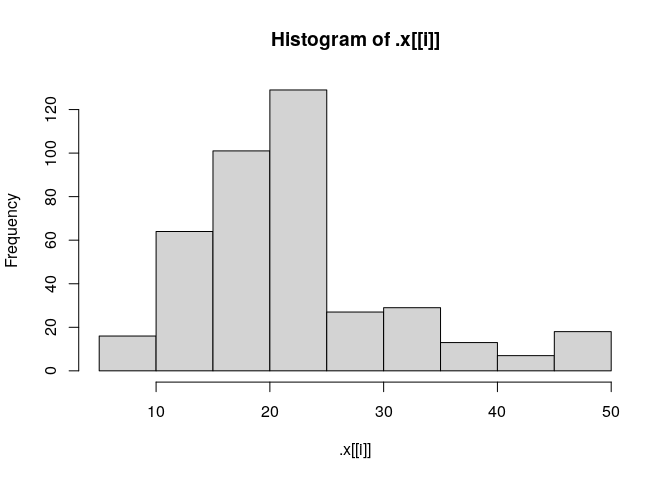
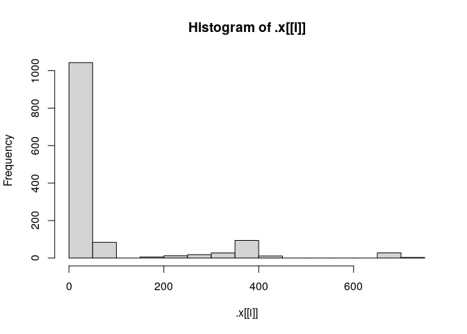
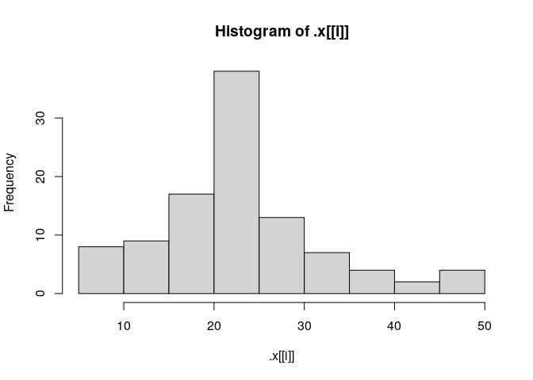

Deep learning with R: Chapter 3
================
Mauro

<https://livebook.manning.com/book/deep-learning-with-r/chapter-3/>

# Setup

## Docker

    -| rocker/tidyverse
      -| rocker/tensorflow
        -| rocker/ml
      -| rocker/cuda 
        -| rocker/tensorflow-gpu
          -| rocker/ml-gpu
        -| rocker/cuda-dev

<https://hub.docker.com/r/rocker/tensorflow>

## Docker

``` bash
# docker run -e PASSWORD=123 -p 8787:8787 rocker/tidyverse
docker start tidyveerse -i
```

## Packages

``` r
library(tidyverse)
library(tensorflow)
library(keras)
library(here)
library(pins)
library(fs)
```

## Packages

``` r
install_tensorflow()
#> 
#> Installation complete.

install_keras()
#> 
#> Installation complete.
```

## Cache data

``` r
# Not portable
board_cache_path()
#> [1] "/home/rstudio/.cache/pins"

# Portable
board_register_local(cache = here(".cache"))
```

## Cache data

``` r
pin( dataset_boston_housing(), "boston_housing")

dir_tree(here(".cache"))
#> /home/rstudio/deeplearning/.cache
#> └── local
#>     ├── boston_housing
#>     │   ├── data.rds
#>     │   └── data.txt
#>     ├── data.txt
#>     └── data.txt.lock
```

## House prices

``` r
dataset <- pin_get("boston_housing")
c(c(train_data, train_targets), c(test_data, test_targets)) %<-% dataset
```

## Explore

``` r
housing <- list(train_data, train_targets, test_data, test_targets)

housing %>% vapply(range, numeric(2))
#>      [,1] [,2] [,3] [,4]
#> [1,]    0    5    0  5.6
#> [2,]  711   50  711 50.0

housing %>% walk(hist)
```

<!-- --><!-- --><!-- --><!-- -->

## Scale

``` r
mean <- colMeans(train_data)
std <- apply(train_data, 2, sd)

train_data <- scale(train_data, center = mean, scale = std)
test_data <- scale(test_data, center = mean, scale = std)
```

## Nit

``` r
identical(
  apply(train_data, 2, mean),
  colMeans(train_data)
)
#> [1] TRUE
```

## Interesting (like wrap up)

``` r
build_model <- function() {
  model <- keras_model_sequential() %>%
    # As the data is small, minimize overfitting with a small network
    # Small data also suggests we need K-fold validation
    layer_dense(units = 64, "relu", input_shape = dim(train_data)[[2]]) %>%
    layer_dense(units = 64, "relu") %>%
    # `activation = NULL` allows output in any range (good for scalar regression)
    layer_dense(units = 1)
  
  model %>% 
    compile(
      optimizer = "rmsprop", 
      # New: Square of the difference between predictions and targets
      loss = "mse", 
      # New: Absolute value of the difference between predictions and targets
      # (in this case, "accuracy" makes no sense)
      metrics = c("mae")
    )
}
```

## Trajectory; nit

``` r
k <- 4L
indices <- sample(1:nrow(train_data))
folds <- cut(indices, breaks = k, labels = FALSE)

num_epochs <- 200L

# Oh no!
all_mae_histories <- NULL

for (i in 1:k) {
  message("processing fold #", i, "\n")
  # cat("processing fold #", i, "\n")
  
  val_indices <- which(folds == i, arr.ind = TRUE)
  val_data <- train_data[val_indices, ]
  val_targets <- train_targets[val_indices]
  
  partial_train_data <- train_data[-val_indices, ]
  partial_train_targets <- train_targets[-val_indices]
  
  model <- build_model()
  
  history <- model %>% 
    fit(
      partial_train_data,
      partial_train_targets,
      validation_data = list(val_data, val_targets),
      epochs = num_epochs,
      batch_size = 1,
      verbose = 0
  )
  
  mae_history <- history$metrics$val_mean_absolute_error
  
  # Oh no!
  all_mae_histories <- rbind(all_mae_histories, mae_history)
}
```

## Nit

``` r
average_mae_history <- data.frame(
  epoch = seq(1:ncol(all_mae_histories)),
  validation_mae = apply(all_mae_histories, 2, mean)
)
```

``` r
(m <- matrix(1:8, nrow = 2))
#>      [,1] [,2] [,3] [,4]
#> [1,]    1    3    5    7
#> [2,]    2    4    6    8

identical(
  seq(1:ncol(m)),
  1:ncol(m)
)
#> [1] TRUE
```

## Great way to imporove the plot


